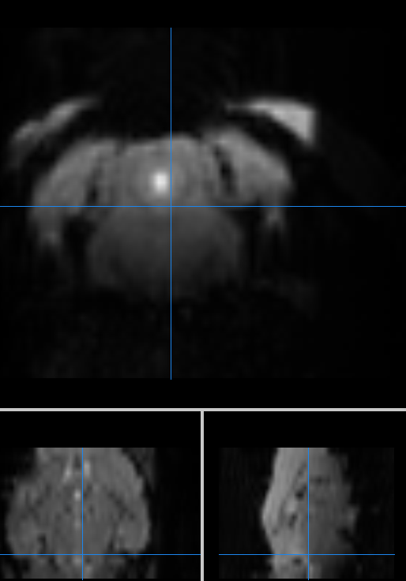
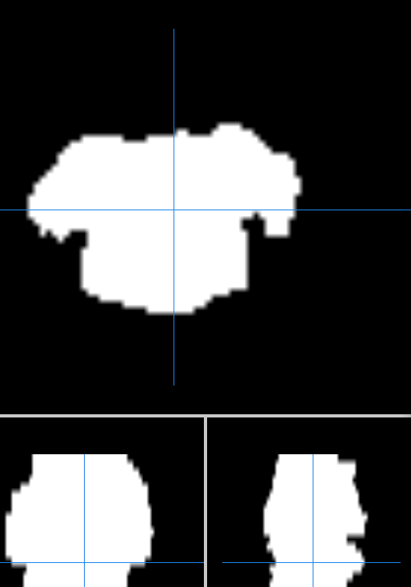
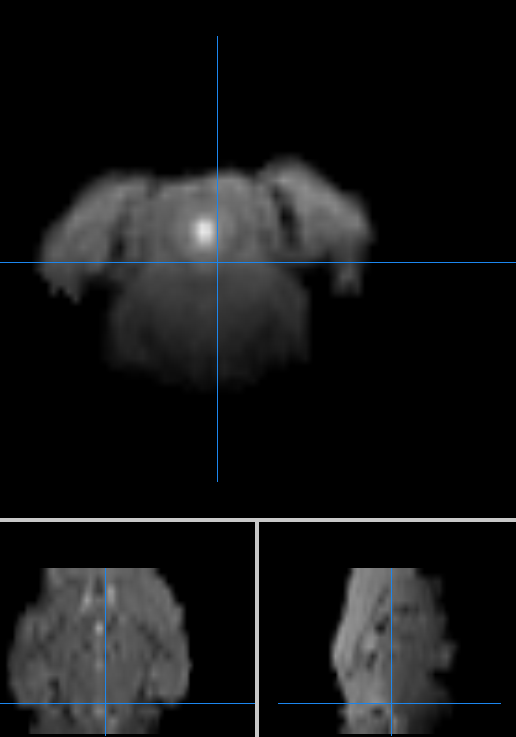
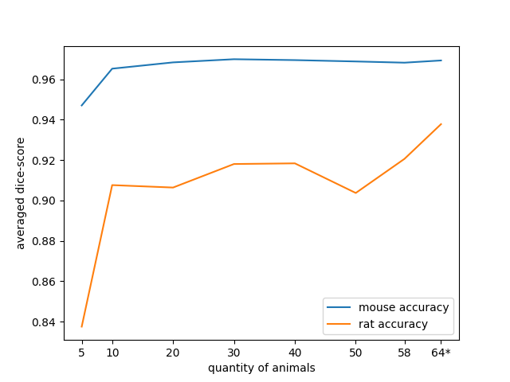
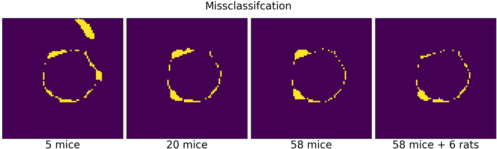

### Rat-Mouse Brain Masking with U-Net

This project demonstrates the application of the U-Net architecture for masking mouse and rat brains. 
It focuses on:
1. the possibility/necessity of transfer-learning from mouse to rat,
2. an analysis of required training data size, and
3. providing a Nifti in-out brain masker.

The code and net structure is inspired by a [PyTorch U-Net implementation](https://github.com/milesial/Pytorch-UNet).
The training process of the model will be added in one of the next versions.

### Demo

| Input | U-Net mask | U-Net Output |
|-------|------------|--------------|
| |  |   

### Installation

- Activate the Anaconda environment if available. 
- If git is missing: install it via ```conda install -c anaconda git```
- Install the package with ```pip install git+https://github.com/lucasplagwitz/rm_masking.git```.
- Start the transformation with ```python -c "from rm_masking import predict; predict.run(r'/path/to/input_niis/', r'/path/to/output_niis/')"```

### Analysis

In addition, we tested how many mice are needed for the segmentation process. 
It is also interesting to observe how well the algorithm can be transferred to the rat. 
In one case only mice are used for learning, in the other case some rats are additionally involved for learning.

<p align="center">
    
</p>
It turns out that in the environment we have chosen, 
a number of 30 mice is sufficient. Beyond that, 
we cannot see any improvements. However, it is clear 
to see that training with rat data improves this prediction significantly.

<p align="center">
    
</p>

### References
[1] [O. Ronneberger, P. Fischer, T. Brox: U-Net: Convolutional Networks for Biomedical Image Segmentation. 
Medical Image Computing and Computer-Assisted Intervention – MICCAI 2015 pp 234-241.](https://link.springer.com/chapter/10.1007/978-3-319-24574-4_28)